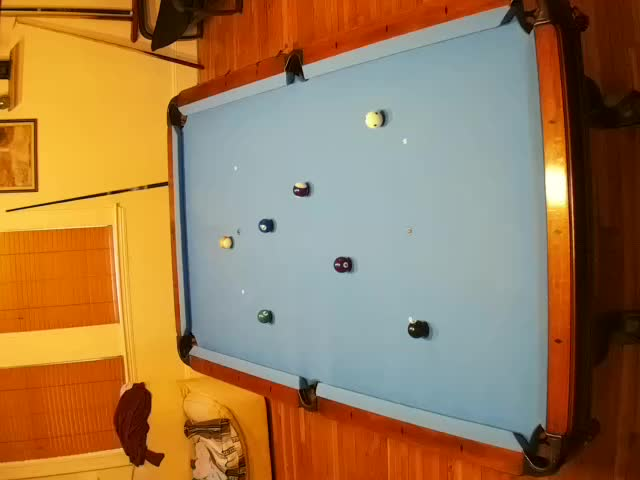
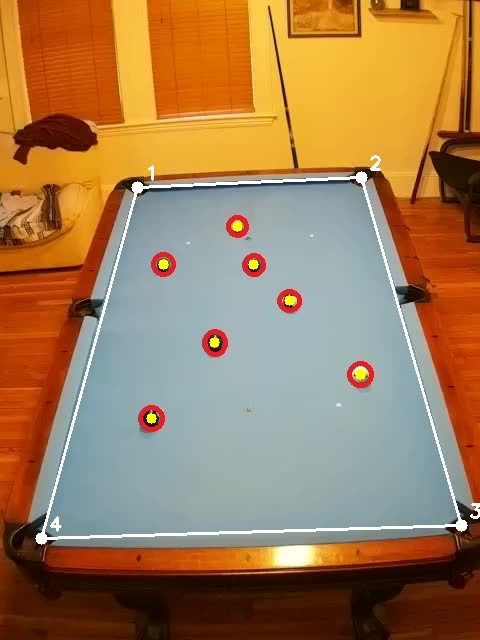
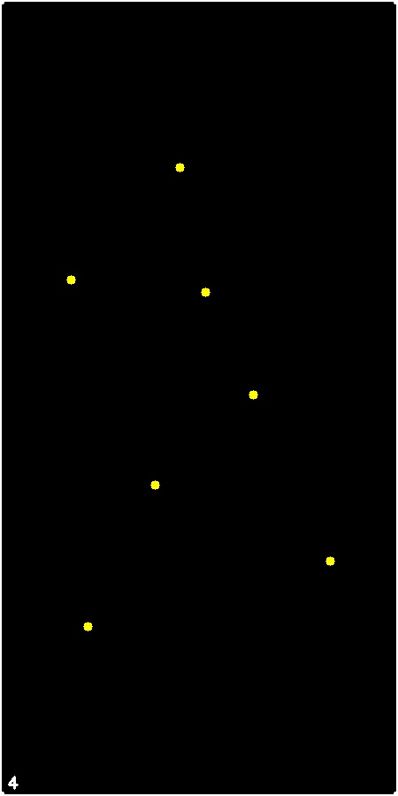

# billiards-ai

## PHASE 1
This phase demonstrates how a homography maps the camera's perspective view to a bird's-eye view that is easier for game analysis.

### Image pipeline

1. Raw input photo: an original camera image of the table.
2. Pre-homography overlay: the same image with the user-calibrated table corners, table boundary, and ball centers marked.
3. Post-homography output: the normalized top-down game state where detected locations are translated into a consistent coordinate frame.

### Visual demonstration

Raw image:

Pre-homography overlay:

Post-homography output:

### Video demonstration

<video width="640" height="480" controls>
  <source src="public/recording-output-clip.mp4" type="video/mp4">
  Your browser does not support the video tag.
</video>

